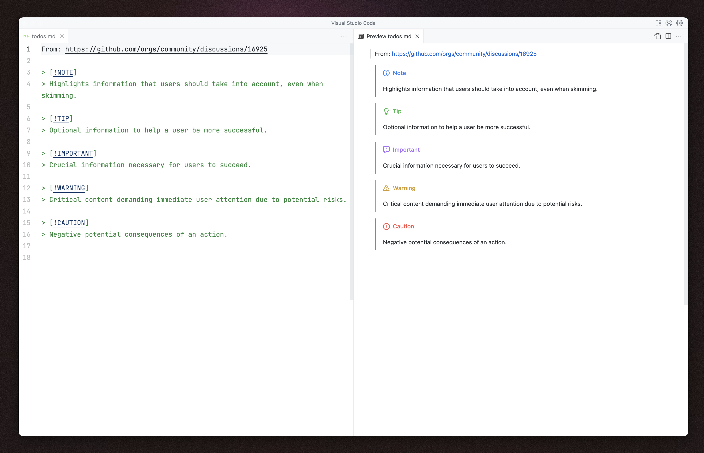

# markdown-alert-blocks README

This is a very minimal extension that allows for rendering of Github's [Render Blocks](https://github.com/orgs/community/discussions/16925). This package is a *very* loose wrapper on the markdown-it extension created by https://github.com/mdit-plugins/mdit-plugins.

## Release Notes

### 0.1.0

Initial release of package. 
